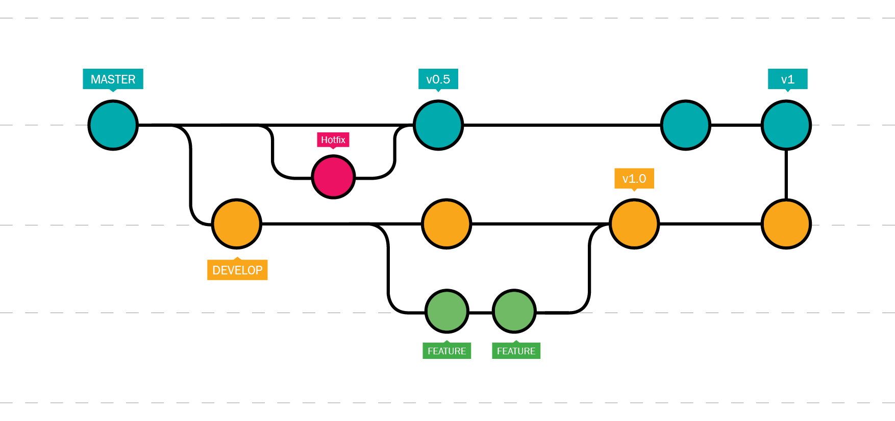

# Contributing

## Code Conventions

We try to follow [Rust API Guidelines](https://rust-lang.github.io/api-guidelines/about.html) and the [Rust Style Guide](https://doc.rust-lang.org/beta/style-guide/index.html).

## Git usage

We use the [Conventional Commits 1.0.0](https://www.conventionalcommits.org/en/v1.0.0/) specification to format our commits.

As for our workflow, we use the following with the following branch names :
- hotfix : `hotfix/<hotfix name>`
- feature : `feat/<feature name>`
- develop : `dev/<version number>`



## Versioning

We use the [Semantic Versioning](https://semver.org/).

Here's a modified version of the Quick Start section that focuses on development with devenv:

## Development Quick Start

### Prerequisites
- Rust 1.81.0+
- PostgreSQL 13+
- [devenv](https://devenv.sh/) for development environment setup

```bash
# Clone repository
git clone https://github.com/DualHorizon/malbox.git
cd malbox

# Setup development environment using devenv
devenv up

# Configure
cp configuration/malbox.example.toml configuration/malbox.toml
$EDITOR configuration/malbox.toml

# Build and run in development mode
cargo build
cargo run
```

> [!IMPORTANT]
> Docker support is planned for a future release to simplify production deployment and to present an alternative to devenv/nix.
