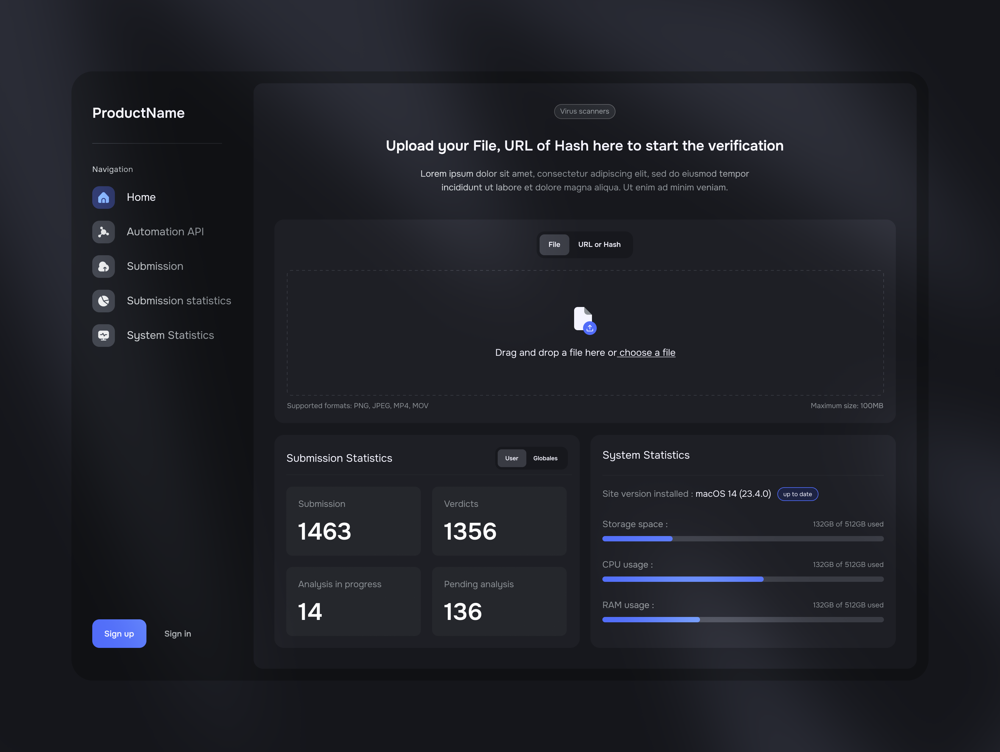

# Malbox - Malware in a Box
Malbox is an advanced sandboxing solution designed for static and dynamic malware analysis. 
The project aims to provide a comprehensive, self-hosted, fast, and user-friendly platform for studying and analyzing various types of malware. 
Malbox is fully open-source, modular, and community-oriented, making it an excellent resource for cybersecurity researchers, analysts, and developers interested in understanding the behavior of malicious software.

## Features
- Modern Analysis: Quickly analyze malware samples with efficient and modern techniques.
- Static and Dynamic Analysis: Supports both static (file-based) and dynamic (runtime) analysis of malware.
- Modular Architecture: Easily extend and customize the platform with additional modules and plugins.
- User-Friendly Interface: Interact with the platform using a straightforward, intuitive interface.
- Community-Oriented: Collaborate with other researchers and contribute to the project for continuous improvement.
- Extensive Documentation: Access comprehensive resources to help you get started and make the most of Malbox.

## Roadmap

**v0.1.0**
- [x] Integrate DB management (PostgreSQL)
- [x] Basic back-end structure
- [x] Task/submission management
- [x] Plugin/Module system with stable_abi
- [ ] Modular machinery management via plugins
- [ ] Modular task scheduling via plugins
- [ ] Modular storage via plugins
- [ ] Create basic analysis plugins
- [ ] Configuration options (machines, submissions, file persistence, etc..) 
- [ ] Create more REST API endpoints for diverse things

**v0.2.0**
- [ ] Refactor plugin/module system, create a rustc driver instead of using stable_abi
- [ ] Implement more complex plugins and cover as much as possible for detection (agent-less analysis)

---

