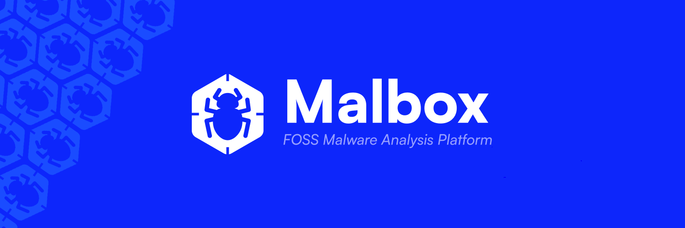

[Documentation](https://dualhorizon.github.io/malbox-docs/) • [Installation](https://dualhorizon.github.io/malbox-docs/getting-started/quickstart/) • [API Reference](https://dualhorizon.github.io/malbox-docs/reference/api/) • [Plugin Marketplace](#) • [Discord](https://discord.gg/7BVnQHRy7h)

---

> [!IMPORTANT]  
> Malbox is still in a very early stage of development, currently, the platform as is, isn't ready to be utilized.
> There are still a lot of rough edges, the code is for the most part not refactored/optimized, and all features described
> further-on may not be implemented yet (or only partially).

> The estimated release version to achieve something functional and stable is `v0.4.0`. 

# Overview

Malbox is an open-source malware analysis platform designed to provide security researchers, malware analysts, and cybersecurity teams with a powerful, extensible environment for analyzing files and understanding their behavior. 

## Why Malbox?

- **Plugin Architecture**: Extend functionality easily through plugins, which can be written in Rust, Javascript and Python. Malbox's plugin system lets you extend functionality as easily as installing a package, and discover them through the Malbox marketplace.
- **High Performance**: Malbox does not compromise on performance despite its modular plugin system. It primarily uses [iceoryx2](https://docs.rs/iceoryx2/latest/iceoryx2/), a shared-memory IPC (Inter-Process-Communication) library that enables zero-copy and lock-free communication. In addition, plugin creators and users can declare and configure plugin specifics, often resulting in more optimized runtimes and adaptable use cases. 
- **Completely Free and Self-Hostable**: Retain full control over your infrastructure—Malbox will remain open-source and free forever.
- **User-friendly Ecosystem**: Malbox’s built-in marketplace makes it easy to install official and community verified plugins. Installation does not require rebuilding or restarting the Malbox service. Plugins and profiles follow strict standards to ensure a healthy, thriving ecosystem.
- **Cloud or On-Premise Storage and Deployment**: Malbox supports both cloud-based and on-premise solutions for your infrastructure and storage needs.
- **Easy Setup**: Enjoy a user-friendly, minimal-overhead setup that is ready to use within minutes. Malbox emphasizes declarative configuration to reduce complexity and simplify the setup and configuration process.

# Plugin Ecosystem

At the core of Malbox is its extensible plugin system, designed for analysis flexibility while maintaining process isolation. Plugins operate with a well-defined lifecycle and communication framework that enables seamless integration of new capabilities, sharing data between plugins without any duplication, and much more.

Plugins are discoverable via metadata, which defines their capabilities, requirements, and compatibility with other plugins. This allows for creating comprehensive analysis profiles that combine multiple plugins for in-depth examination of artifacts.

## Plugin Marketplace

Access community verified or official plugins through our [Marketplace](#) - also available in your self-hosted Malbox instance:

#### Official Plugins

#### Featured Community Plugins

> [!IMPORTANT]  
> All plugins undergo security review and verification before being listed in the marketplace. [Submit your plugin](#)

## Features

### Analysis Capabilities

Analysis capabilities depend on the plugins installed, hence, the capabilities will continue to grow as plugins are released, both from the community and maintainers.
For good measure, you can find a couple of functionalities that will be available through official plugins.

- **File Type Support**
  - Windows Executables (PE32, PE32+)
  - Linux Executables (ELF)
  - Office Documents
  - PDF Files
  - Script Files (JS, VBS, PS1)
  - Archive Files

- **Analysis Features**
  - Automated unpacking
  - String extraction
  - Entropy analysis
  - Network analysis
  - Memory inspection
  - Behavioral analysis
  - Custom scripting support

###  Enterprise Features

- Multi-user support with RBAC
- Team management
- API access and monitoring
- Custom reporting
- Integration capabilities

## Support & Community

- [Documentation](#)
- [GitHub Issues](https://github.com/DualHorizon/malbox/issues)
- [Discord Community](https://discord.gg/XWBdpQ5bMp)

## Contributing

We welcome contributions! See our [Contributing Guide](CONTRIBUTING.md) for development setup and guidelines.
Also, feel free to submit issues, Malbox's development is still in an early stage and contains a lot of rough edges!

## License

Licensed under GNU General Public License (GPL) - © 2024 Malbox Contributors

---

**[⬆ Back to Top](#top)** • Made with ❤️ by the Malbox maintainers and its contributors

