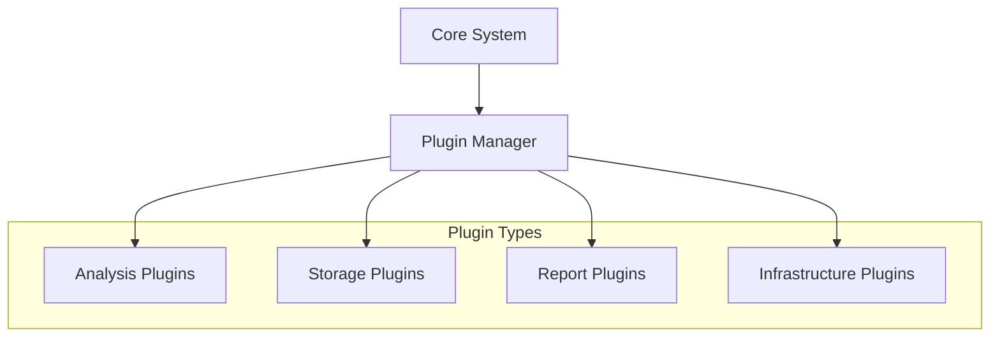

<div align="center">

[](https://www.rust-lang.org/)
[](LICENSE)
[](https://github.com/DualHorizon/malbox/releases)
[](https://github.com/DualHorizon/malbox/actions)
[](https://codecov.io/gh/DualHorizon/malbox)
[](https://discord.gg/your-invite)
[](https://marketplace.malbox.io)

[Documentation](docs) • [Installation](docs/installation.md) • [API Reference](docs/api) • [Plugin Marketplace](https://marketplace.mal.box) • [Discord](https://discord.gg/XWBdpQ5bMp)

</div>

---


> [!IMPORTANT]  
> Malbox is still in a very early stage of development, currently, the platform as is isn't ready to be utilized.
> The estimated release version to achieve something functional and stable is `v0.4.0`. 


## Overview

Malbox is an enterprise-grade malware analysis platform built in Rust. Its plugin-driven architecture enables security teams and malware analysis enthousiasts to extend and customize analysis capabilities while maintaining high performance and stability.


### Why Malbox?

- **Plugin Architecture**: Extend functionality through plugins, which can be written in Rust, Javascript and Python.
- **High Performance**: Malbox is using [iceoryx2](https://docs.rs/iceoryx2/latest/iceoryx2/), a shared memory IPC (Inter-Process-Communication) library, allowing zero-copy and lock-free inter-process communication.
- **Completely Free and Self-Hostable**: Complete control over your infrastructure
- **Large Ecosystem**: Thanks to Malbox's built-in marketplace, you can easily install and go through official and verified plugins, not rebuild or restart required, hot-reloading all the way!
- **Cloud or On-Premise**: Malbox supports cloud providers and on-premise for machinery and storage.
- **Easy Deployment**: User-friendly and no-overhead setup of the platform, ready to use within a few minutes.

## Plugin Ecosystem

At the core of Malbox is its extensible plugin system, powered by high-performance IPC using iceoryx2. Plugins maintain process isolation while enabling seamless integration of new capabilities.
Each plugin has metadata, and can be qualified for specific categories, plugins can be grouped together in different analysis profiles, which are also available through the marketplace.



### Plugin Types

- **Static Analysis**
  - PE/ELF/MachO analysis
  - YARA pattern matching
  - String and entropy analysis
  - Digital signature verification
  - Office document analysis
  - PDF analysis
  
- **Dynamic Analysis**
  - Process monitoring
  - Network traffic analysis
  - Memory analysis
  - Registry monitoring
  - Behavioral tracking
  - Anti-VM detection mitigation

- **Unpacking**

> [!WARNING]  
> Plugin categories aren't defined yet, this is just a rough idea of what they could be. Stay tuned for updates!

### Plugin Marketplace

Access 50+ verified and official plugins from our [Marketplace](https://marketplace.mal.box) or at your self-hosted Malbox instance:


#### Official Plugins
[](https://marketplace.malbox.io/plugins/pe-analysis)
[](https://marketplace.malbox.io/plugins/network-monitor)
[](https://marketplace.malbox.io/plugins/yara-engine)
[](https://marketplace.malbox.io/plugins/memory-analysis)

#### Featured Community Plugins
[](https://marketplace.malbox.io/plugins/threat-intel)
[](https://marketplace.malbox.io/plugins/ml-classifier)
[](https://marketplace.malbox.io/plugins/report-gen)

> [!IMPORTANT]  
> All plugins undergo security review and verification before being listed in the marketplace. [Submit your plugin](docs/plugins/publishing.md)

## Features

### Analysis Capabilities

Analysis capabilities depend on the plugins installed, hence, the capabilities will continue to grow as the project lives.
For good measure, you can find a couple of functionalities that are already available through our plugins.

- **File Type Support**
  - Windows Executables (PE32, PE32+)
  - Linux Executables (ELF)
  - macOS Executables (MachO)
  - Office Documents
  - PDF Files
  - Script Files (JS, VBS, PS1)
  - Archive Files

- **Analysis Features**
  - Automated unpacking
  - String extraction
  - Entropy analysis
  - Network simulation
  - Memory inspection
  - Behavioral analysis
  - Custom scripting support


### Enterprise Features

- Multi-user support with RBAC
- Team management
- API access and monitoring
- Custom reporting
- Integration capabilities

## Technology Stack

| Component | Technology | Details |
|-----------|------------|----------|
| Core |  | Safe, high-performance execution |
| IPC |  | Zero-copy plugin communication |
| Database |  | Reliable state management |
| API |  | Modern web framework |
| Frontend |  | Fast, static frontend |

## Performance

### Analysis Metrics

| Operation | Performance | Notes |
|-----------|-------------|--------|
| Static Analysis | 2-5 seconds | PE files up to 10MB |
| Dynamic Analysis | 45-60 seconds | Full system monitoring |
| Concurrent Analyses | 50+ | With recommended hardware |
| Memory Usage | 512MB base | +256MB per analysis |
| Storage Required | 20GB+ | Scales with retention policy |

## Quick Start

### Prerequisites
- Rust 1.81.0+
- PostgreSQL 13+
- One of: KVM, VMware, or VirtualBox

```bash
# Install
git clone https://github.com/DualHorizon/malbox.git
cd malbox

# Configure
cp configuration/malbox.example.toml configuration/malbox.toml
$EDITOR configuration/malbox.toml

# Build and Run
cargo build --release
cargo run --release
```

Detailed setup instructions available in our [Installation Guide](docs/installation.md).

### Docker Support

```bash
# Pull official image
docker pull malbox/malbox:latest

# Start with docker-compose
wget https://raw.githubusercontent.com/DualHorizon/malbox/main/docker-compose.yml
docker-compose up -d
```

## Support & Community

- [Documentation](https://docs.malbox.io)
- [GitHub Issues](https://github.com/DualHorizon/malbox/issues)
- [Discord Community](https://discord.gg/your-invite)
- [Enterprise Support](https://malbox.io/enterprise)

## Contributing

We welcome contributions! See our [Contributing Guide](CONTRIBUTING.md) for development setup and guidelines.
Also, feel free to submit issues, Malbox's development is still in an early stage and contains a lot of rough edges!

## License

Licensed under GNU General Public License (GPL) - © 2024 Malbox Contributors

---

<div align="center">

**[⬆ Back to Top](#top)** • Made with ❤️ by the Malbox Team

<a href="https://star-history.com/#DualHorizon/malbox">
  
</a>

</div>
