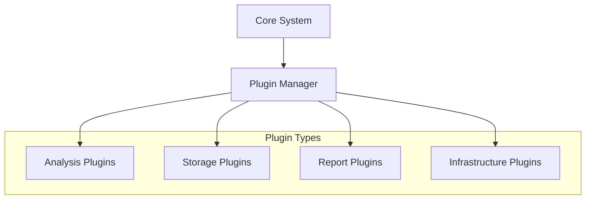

<div align="center">

[](https://www.rust-lang.org/)
[](LICENSE)
[](https://github.com/your-username/malbox/releases)
[](https://github.com/your-username/malbox/actions)
[](https://codecov.io/gh/your-username/malbox)
[](https://discord.gg/your-invite)
[](https://marketplace.malbox.io)

[Documentation](docs) • [Installation](docs/installation.md) • [API Reference](docs/api) • [Plugin Marketplace](https://marketplace.malbox.io) • [Discord](https://discord.gg/your-invite)

</div>

---

## Overview

Malbox is an enterprise-grade malware analysis platform built in Rust. Its plugin-driven architecture enables security teams to extend and customize analysis capabilities while maintaining high performance and security.


### Why Malbox?

- **Plugin Architecture**: Extend functionality through our marketplace of verified plugins
- **High Performance**: 50+ concurrent analyses using Rust and efficient IPC
- **Secure**: Built-in process isolation and containment
- **Self-Hosted**: Complete control over your infrastructure
- **Enterprise Ready**: Role-based access control and audit logging

## Plugin Ecosystem

At the core of Malbox is its extensible plugin system, powered by high-performance IPC using iceoryx2. Plugins maintain process isolation while enabling seamless integration of new capabilities.



### Plugin Types

<details>
<summary><b>Analysis Plugins</b></summary>

- **Static Analysis**
  - PE/ELF/MachO analysis
  - YARA pattern matching
  - String and entropy analysis
  - Digital signature verification
  - Office document analysis
  - PDF analysis
  
- **Dynamic Analysis**
  - Process monitoring
  - Network traffic analysis
  - Memory analysis
  - Registry monitoring
  - Behavioral tracking
  - Anti-VM detection mitigation

</details>

<details>
<summary><b>Storage Plugins</b></summary>

- **Local Storage**
  - File system storage
  - Sample management
  - Result caching

- **Cloud Storage**
  - Amazon S3
  - Azure Blob Storage
  - Google Cloud Storage
  - MinIO compatible systems

</details>

<details>
<summary><b>Infrastructure Plugins</b></summary>

- **Virtualization**
  - KVM/QEMU integration
  - VMware ESXi support
  - VirtualBox management
  
- **Containerization**
  - Docker support
  - Kubernetes integration
  - Custom providers

</details>

### Plugin Marketplace

Access 50+ verified plugins from our [Marketplace](https://marketplace.malbox.io) or at your self-hosted Malbox instance:


#### Official Plugins
[](https://marketplace.malbox.io/plugins/pe-analysis)
[](https://marketplace.malbox.io/plugins/network-monitor)
[](https://marketplace.malbox.io/plugins/yara-engine)
[](https://marketplace.malbox.io/plugins/memory-analysis)

#### Featured Community Plugins
[](https://marketplace.malbox.io/plugins/threat-intel)
[](https://marketplace.malbox.io/plugins/ml-classifier)
[](https://marketplace.malbox.io/plugins/report-gen)

All plugins undergo security review and verification before being listed in the marketplace. [Submit your plugin](docs/plugins/publishing.md)

## Features

### Analysis Capabilities

- **File Type Support**
  - Windows Executables (PE32, PE32+)
  - Linux Executables (ELF)
  - macOS Executables (MachO)
  - Office Documents
  - PDF Files
  - Script Files (JS, VBS, PS1)
  - Archive Files

- **Analysis Features**
  - Automated unpacking
  - String extraction
  - Entropy analysis
  - Network simulation
  - Memory inspection
  - Behavioral analysis
  - Custom scripting support


### Security Features

- Process-level sandboxing
- Network traffic isolation
- Memory protection
- Role-based access control
- Comprehensive audit logging
- Sample quarantine system

### Enterprise Features

- Multi-user support
- Team management
- API access
- Custom reporting
- Integration capabilities
- SLA support

## Technology Stack

<p align="center">
  
</p>

| Component | Technology | Details |
|-----------|------------|----------|
| Core |  | Safe, high-performance execution |
| IPC |  | Zero-copy plugin communication |
| Database |  | Reliable state management |
| API |  | Modern web framework |
| Frontend |  | Fast, static frontend |

## Performance

### Analysis Metrics

| Operation | Performance | Notes |
|-----------|-------------|--------|
| Static Analysis | 2-5 seconds | PE files up to 10MB |
| Dynamic Analysis | 45-60 seconds | Full system monitoring |
| Concurrent Analyses | 50+ | With recommended hardware |
| Memory Usage | 512MB base | +256MB per analysis |
| Storage Required | 20GB+ | Scales with retention policy |

## Quick Start

### Prerequisites
- Rust 1.81.0+
- PostgreSQL 13+
- One of: KVM, VMware, or Hyper-V
- 8GB RAM, 4 cores minimum

```bash
# Install
git clone https://github.com/your-username/malbox.git
cd malbox

# Configure
cp configuration/malbox.example.toml configuration/malbox.toml
$EDITOR configuration/malbox.toml

# Build and Run
cargo build --release
cargo run --release
```

Detailed setup instructions available in our [Installation Guide](docs/installation.md).

### Docker Support

```bash
# Pull official image
docker pull malbox/malbox:latest

# Start with docker-compose
wget https://raw.githubusercontent.com/your-username/malbox/main/docker-compose.yml
docker-compose up -d
```

## Support & Community

- [Documentation](https://docs.malbox.io)
- [GitHub Issues](https://github.com/your-username/malbox/issues)
- [Discord Community](https://discord.gg/your-invite)
- [Enterprise Support](https://malbox.io/enterprise)

## Contributing

We welcome contributions! See our [Contributing Guide](CONTRIBUTING.md) for development setup and guidelines.

## License

Licensed under MIT - © 2024 Malbox Contributors

---

<div align="center">

**[⬆ Back to Top](#top)** • Made with ❤️ by the Malbox Team

<a href="https://star-history.com/#your-username/malbox">
  
</a>

</div>
